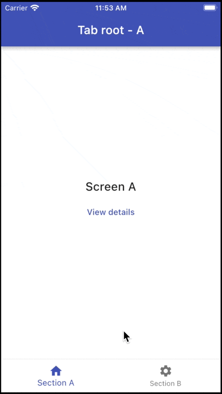

# Stateful Nested Navigation with Beamer

## Notes

Stateful nested navigation is fully supported using nested `BeamerDelegates`.

See this file for more details:

- [scaffold_with_bottom_nav_bar.dart](lib/src/routing/scaffold_with_bottom_nav_bar.dart)