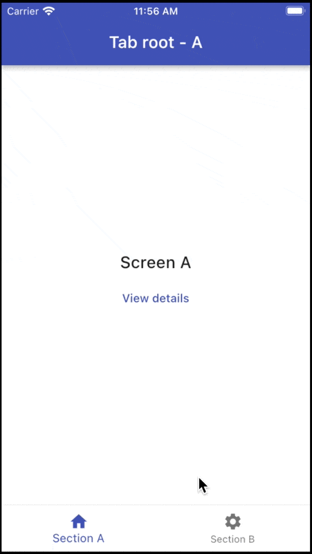

# Stateful Nested Navigation with GoRouter

## Notes

Stateful nested navigation is fully supported since [GoRouter 7.1](https://pub.dev/packages/go_router/changelog#710)

See this PR for more details:

- [[go_router] Nested stateful navigation with ShellRoute](https://github.com/flutter/packages/pull/2650)

